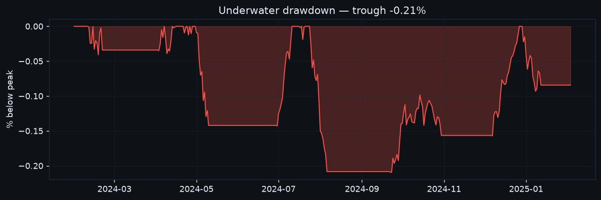
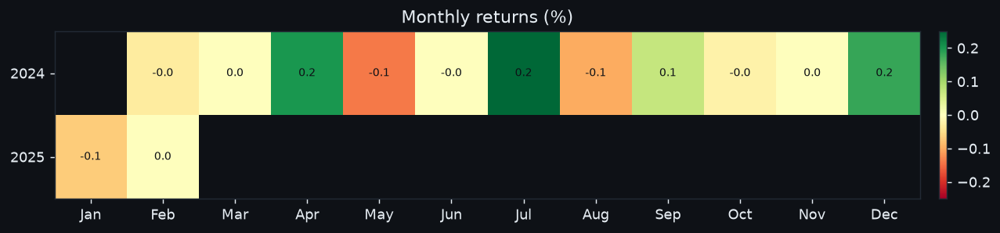
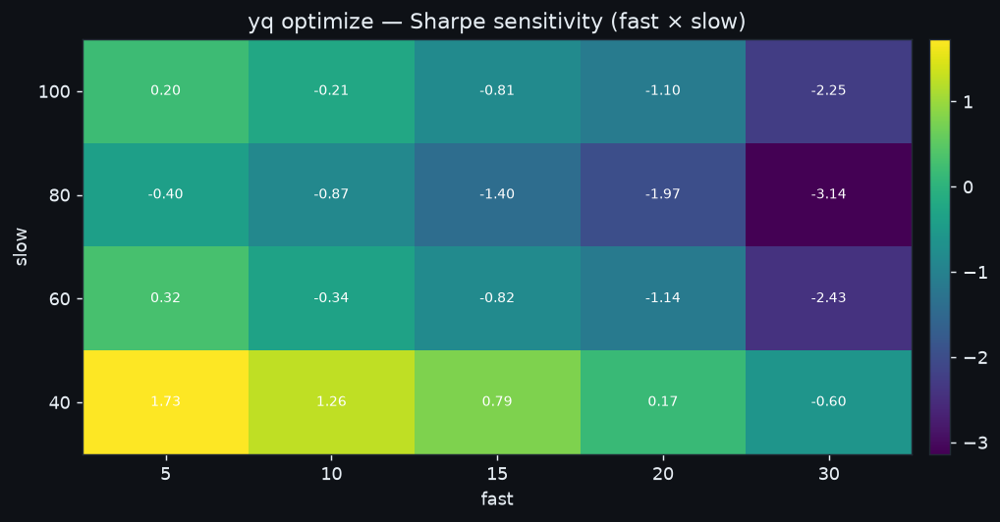
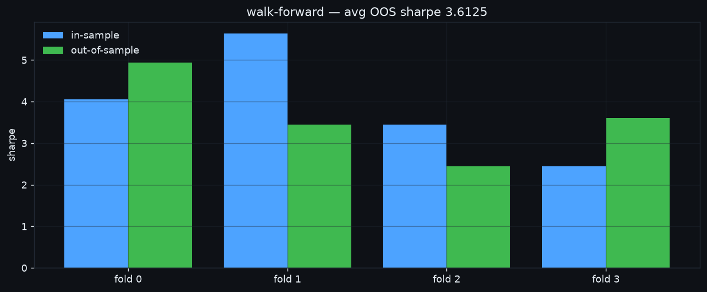
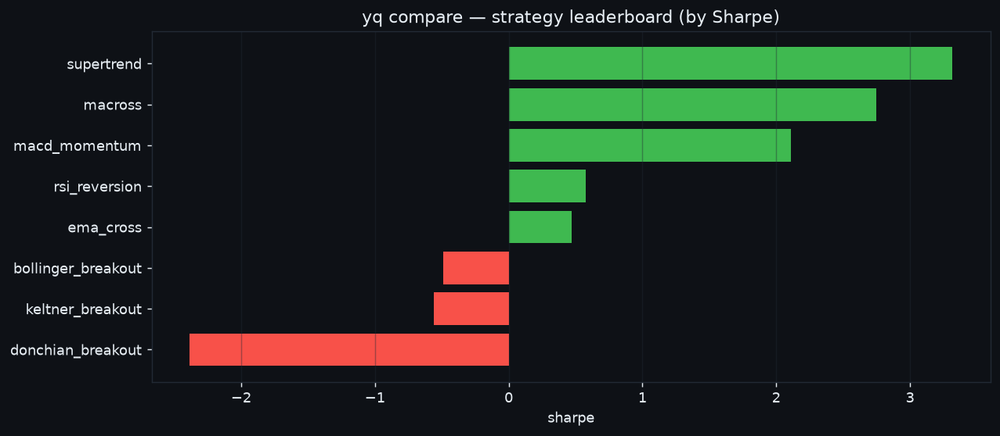
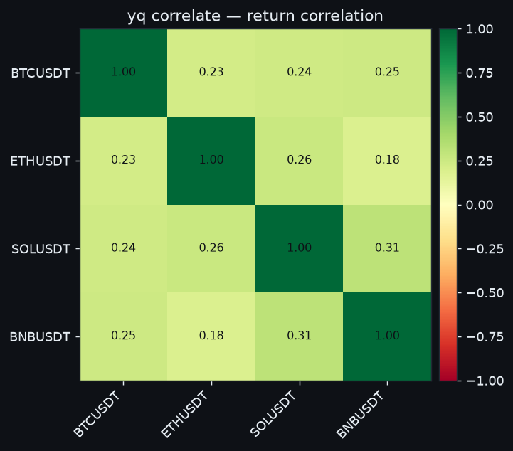

# Worked examples

Real `yq` sessions on seeded data (BTCUSDT / ETHUSDT / SOLUSDT, 500×1d each) —
every command below was actually run; the JSON is its real output. Pipe output is
JSON; in a terminal the same data renders as colored tables/boxes.

!!! note "Setup"
    These use a local store so they run offline. In normal use `yq collect`
    fills the store from an exchange first. All commands accept `--store` /
    `--state` to point at specific files.

## Research a strategy

```console
$ yq backtest BTCUSDT 1d keltner_breakout
{
  "bars": 479, "start_equity": 10000.0, "end_equity": 10379.65,
  "total_return": 0.038, "sharpe": 1.732, "sortino": 1.908, "calmar": 4.22,
  "max_drawdown": -0.0068, "num_trades": 24, "num_closed": 5, "win_rate": 0.0,
  "benchmark_return": 0.1174, "excess_return": -0.0794
}
```

!!! tip "vs buy & hold"
    Every backtest now reports `benchmark_return` (holding the asset over the
    same window) and `excess_return` (strategy minus benchmark). A *negative*
    `excess_return` — as here — means buy-and-hold beat the strategy; the edge
    has to clear that bar to be worth trading. The dashboard draws the same
    benchmark as a dashed line on the equity curve.

!!! tip "Reading it"
    `total_return` is equity-based (includes the **unrealized** mark-to-market of
    an open position), while `win_rate` / `best_trade` cover only **closed**
    round-trips. A trend strategy that ends holding a winning long can show a
    positive return with few/no closed wins — the gains are still on the book.

!!! tip "Drawdown"
    The dashboard Research panel draws an **underwater chart** beneath the equity
    curve — equity as a percentage below its running peak. Its trough is exactly
    the `max_drawdown` stat, so you can *see* how long and how deep each
    drawdown ran, not just its worst point.



!!! tip "Monthly returns"
    The panel also renders a **calendar heatmap** of month-by-month returns
    (green positive / red negative). Compounding the cells reconciles with
    `total_return`; the grid makes consistency and seasonality obvious — a few
    big months vs a steady drip read very differently for the same total.



## Optimize parameters

```console
$ yq optimize BTCUSDT 1d macross --metric sharpe
{
  "metric": "sharpe",
  "best_params": {"fast": 20, "slow": 100},
  "best_score": 1.431,
  "top": [
    {"params": {"fast": 20, "slow": 100}, "score": 1.431},
    {"params": {"fast": 10, "slow": 100}, "score": 1.092},
    {"params": {"fast": 5,  "slow": 100}, "score": 1.015}
  ]
}
```

The response also carries the **full grid** under `results` (every combo, not
just the top 5). When a grid varies exactly two parameters, the dashboard
Research panel renders it as a **sensitivity heatmap** (e.g. `fast` × `slow` →
Sharpe) — a robust plateau of good scores beats a lone spike that's likely
overfit.



### Validate out-of-sample (walk-forward)

```console
$ yq optimize BTCUSDT 1d macross --walk-forward 4
{
  "metric": "sharpe", "n_folds": 4, "avg_out_of_sample": 0.348,
  "folds": [
    {"fold": 0, "best_params": {"fast": 10, "slow": 50}, "in_sample": 0.0,   "oos_sharpe": -1.365},
    {"fold": 1, "best_params": {"fast": 20, "slow": 30}, "in_sample": 0.307, "oos_sharpe": 0.0},
    {"fold": 2, "best_params": {"fast": 5,  "slow": 50}, "in_sample": 0.0,   "oos_sharpe": 2.757},
    {"fold": 3, "best_params": {"fast": 5,  "slow": 50}, "in_sample": 2.757, "oos_sharpe": 0.0}
  ]
}
```

The per-fold gap between `in_sample` and `oos_sharpe` is the overfitting tell —
chase the `avg_out_of_sample`, not the grid's best in-sample score. The dashboard
Research panel plots exactly this, in-sample vs out-of-sample per fold:



## Rank every strategy (leaderboard)

Don't guess which edge fits a symbol — run them all and rank:

```console
$ yq compare BTCUSDT 1d --strategies keltner_breakout,donchian_breakout,rsi_reversion --metric sharpe
{
  "ticker": "BTCUSDT", "interval": "1d", "metric": "sharpe",
  "benchmark_return": 0.1442,
  "ranking": [
    {"strategy": "keltner_breakout",  "sharpe": 1.732, "total_return": 0.038,  "excess_return": -0.0794, "num_trades": 24},
    {"strategy": "donchian_breakout", "sharpe": 1.520, "total_return": 0.0409, "excess_return": -0.0714, "num_trades": 34},
    {"strategy": "rsi_reversion",     "sharpe": 1.217, "total_return": 0.0173, "excess_return": -0.0723, "num_trades": 15}
  ],
  "errors": {}
}
```

Omit `--strategies` to rank all 19. `benchmark_return` is buy-and-hold over the
full window (a stable reference for every row); `--metric` accepts
`sharpe` / `total_return` / `excess_return` / `sortino` / `calmar` / `cagr` /
`win_rate`. The dashboard **Strategy leaderboard** panel plots the same ranking
as a bar chart. Strategies that error (e.g. too little data) land in `errors`
instead of failing the whole run.



## Blend strategies (ensemble)

```console
$ yq ensemble BTCUSDT 1d --members macross,supertrend,rsi_reversion --rule weighted --threshold 0.4
{
  "bars": 449, "total_return": 0.0013, "sharpe": 0.533, "num_trades": 3,
  "members": ["macross", "supertrend", "rsi_reversion"], "rule": "weighted"
}
```

## Portfolio backtest

```console
$ yq portfolio BTCUSDT ETHUSDT SOLUSDT --strategy keltner_breakout   # add --risk-parity for inverse-vol sizing
{
  "portfolio": {"total_return": 0.1808, "sharpe": 2.254, "max_drawdown": -0.0333},
  "per_symbol": {
    "BTCUSDT": {"total_return": 0.1139, "weight": 0.3333},
    "ETHUSDT": {"total_return": -0.0558, "weight": 0.3333},
    "SOLUSDT": {"total_return": 0.4843, "weight": 0.3333}
  }
}
```

## Risk-parity target weights

Size holdings by inverse volatility so each contributes roughly equal risk:

```console
$ yq target --risk-parity BTCUSDT ETHUSDT SOLUSDT
{"BTCUSDT": 0.3667, "ETHUSDT": 0.3131, "SOLUSDT": 0.3202}

$ yq rebalance --execute     # then move holdings toward those weights
```

## Correlation matrix (diversification check)

Before committing weight to a basket, check that the legs aren't all the same
bet. Low/negative off-diagonals mean real diversification; values near +1 mean
you're doubling down on one factor.

```console
$ yq correlate BTCUSDT ETHUSDT SOLUSDT
{
  "symbols": ["BTCUSDT", "ETHUSDT", "SOLUSDT"],
  "matrix": [
    [ 1.0,   -0.059,  0.109],
    [-0.059,  1.0,    0.057],
    [ 0.109,  0.057,  1.0  ]
  ],
  "lookback": 120, "bars": 120
}
```

In a terminal the matrix renders as a colored table; the dashboard **Correlation**
panel draws the same numbers as a red→green heatmap. Pearson correlation of daily
returns over the last `lookback` bars (default 120).



## Trade (paper) and report

```console
$ yq trade BTCUSDT BUY 0.1 --price 65000 --mode paper
{"id": 1, "status": "filled", "mode": "paper", "side": "BUY", "quantity": 0.1, "price": 65000.0}

$ yq trade BTCUSDT SELL 0.1 --price 71000 --mode paper
{"id": 2, "status": "filled", "side": "SELL", "price": 71000.0}

$ yq report
{"equity_now": 10586.4, "realized_pnl": 592.9, "total_return": 0.0593,
 "closed_trades": 1, "win_rate": 1.0}
```

## Memory: journal then recall

```console
$ yq journal "entered BTC on keltner breakout, vol expanding" --tag thesis --importance 8
$ yq journal "minor note" --importance 2
$ yq recall "BTC breakout"
memories: [(8.0, "entered BTC on keltner breakout, vol e…")]   # low-importance note filtered out
open_positions: []
```

## Self-improvement: author a strategy

```console
$ yq new strategy demo_breakout
{"created": "user_plugins/strategies/demo_breakout.py", "kind": "strategy"}

$ yq plugins
{"strategies": ["demo_breakout"], "indicators": [], "errors": []}

$ yq backtest BTCUSDT 1d demo_breakout      # usable immediately
```

## Inspect the latest features

```console
$ yq features BTCUSDT 1d
{"close": 115.33, "rsi_14": 59.1, "adx_14": 40.75, "atr_pct": 0.0285, "macd_hist": -0.716}
```

---

Every command above is also a dashboard action — see [The dashboard](dashboard.md)
for the point-and-click equivalents (Research, Manual trade, Control center, …).
