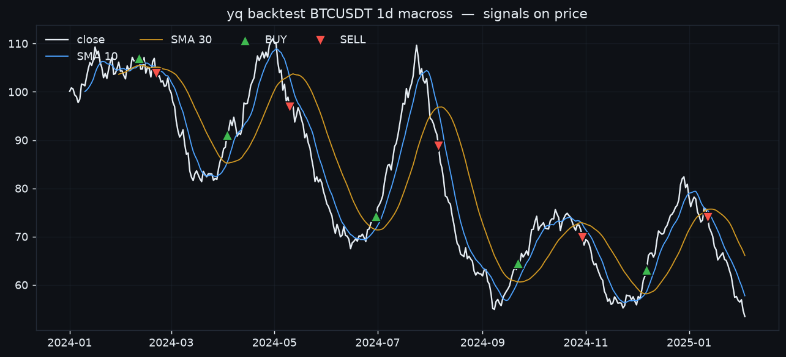

# YammyQuant

An **agentic quant research cockpit**. Claude Code is the *operator* — it drives a
CLI toolbelt over the `yammyquant` library to collect data, backtest, train RL
agents, generate signals, and run a paper/live portfolio. A web dashboard lets
you watch everything live and leave instructions.

!!! tip "No paid LLM API in the loop"
    The brain is your Claude Code session. The dashboard is the cockpit; the
    conversation happens in Claude Code. Nothing here calls a paid inference API.

!!! example "New here? Start with the [**Tutorial**](tutorial.md)"
    A hands-on, end-to-end walkthrough — collect → research → backtest → ensemble
    → signal → risk → trade → automate, every step a real `yq` command.



<div class="grid cards" markdown>

-   :material-rocket-launch: **[Getting started](getting-started.md)**

    Install, collect candles, run a backtest, launch the cockpit.

-   :material-toolbox: **[The toolbelt](toolbelt.md)**

    Every `yq` command, grouped by what you're doing.

-   :material-newspaper: **[Information layer](information-layer.md)**

    Keyless news, DART disclosures, fundamentals, sentiment, research briefs.

-   :material-brain: **[Memory & persistence](memory.md)**

    Where an ephemeral agent keeps what survives a session — and `yq recall`.

</div>

## How it works

One operator, one shared brain-state, two surfaces (CLI + dashboard):

```
Claude Code (operator)  ──drives──▶  yq CLI toolbelt
        │                                │
        │  reads instructions            │ writes state + logs activity
        ▼                                ▼
   ┌──────────────────  shared state  ──────────────────┐
   │  SQLite (positions, trades, equity, signals, news,  │
   │  journal, instruction inbox) + DuckDB candles       │
   └──────────────────────────┬──────────────────────────┘
                              ▼
              FastAPI cockpit + SPA dashboard
       (charts · positions · trade approvals · inbox · news)
```

### The operator loop

1. **Recall first** — you're ephemeral, so reload memory before acting:
   `yq recall` (most-salient notes + unread inbox + open positions).
2. **Do the work** with the toolbelt. Every command logs to shared state, so the
   dashboard updates live.
3. **Record decisions** as trades (paper by default; live orders queue for human
   approval) and as **journal** entries for the next session.

## Why it's different

Compared to freqtrade / Jesse / NautilusTrader and the LLM-agent repos
(ai-hedge-fund, TradingAgents, FinRobot), YammyQuant ships the risk layer,
optimization/walk-forward, multi-exchange data, **and** an information layer — yet
its agentic operator is your Claude Code session, so it needs **no paid LLM API**.
See the [benchmark](BENCHMARK.md).
