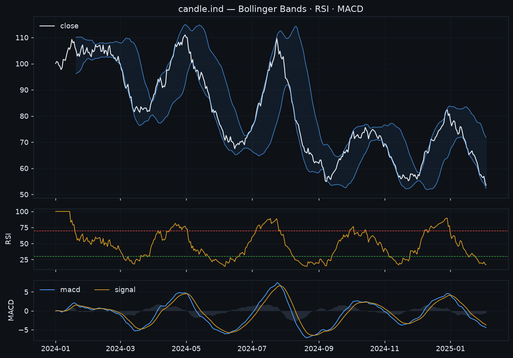

# Strategies & risk

## Built-in strategies

A broad library across every classic family. Toggle them from the cockpit (or
`yq strategies --disable rsi_reversion`); the enabled set is read via
`enabled_strategies(state)` and drives `yq decide`. Every strategy is optimizable
via `yq optimize <sym> <interval> <name>` (each ships a default parameter grid).

=== "Trend following"

    | Name | Idea |
    |---|---|
    | `macross` | SMA fast/slow crossover. |
    | `ema_cross` | EMA fast/slow crossover (scalper's trigger). |
    | `triple_ema` | EMA ribbon (fast/mid/slow) alignment. |
    | `macd_momentum` | MACD line / signal crossover. |
    | `supertrend` | ATR trailing trend; trade direction flips. |
    | `adx_trend` | +DI/−DI crossover gated by ADX strength. |
    | `parabolic_sar` | Parabolic SAR flips vs price. |

=== "Breakout / volatility"

    | Name | Idea |
    |---|---|
    | `volatility_breakout` | Larry Williams k-factor range breakout. |
    | `donchian_breakout` | Break of the N-bar high/low channel. |
    | `bollinger_breakout` | Close breaking outside the Bollinger Bands. |
    | `keltner_breakout` | Break of the Keltner channel (EMA ± ATR). |
    | `opening_range_breakout` | Break of the day's opening range (intraday; optional end-of-day flatten). |
    | `volume_spike_breakout` | Breakout confirmed by a volume spike vs the recent average. |
    | `keltner_squeeze_breakout` | TTM-style squeeze (Bollinger inside Keltner) release + breakout. |

=== "Mean reversion / scalping"

    | Name | Idea |
    |---|---|
    | `rsi_reversion` | Buy oversold / sell overbought RSI crossings. |
    | `bollinger_reversion` | Fade band touches back toward the mean. |
    | `stochastic_scalp` | %K/%D crossover out of OS/OB zones. |
    | `stoch_rsi_scalp` | Stochastic-RSI %K/%D crossover. |
    | `williams_r_scalp` | Williams %R reversal out of extremes. |
    | `cci_reversion` | CCI reversal at ±threshold. |
    | `mfi_reversion` | Money-Flow-Index (volume RSI) reversal. |
    | `vwap_reversion` | Fade deviations from rolling VWAP. |
    | `vwap_band_scalp` | Fade session-VWAP ± σ bands back toward VWAP (intraday scalp). |
    | `micro_pullback` | Buy shallow pullbacks within an established up-trend (fast/slow EMA). |
    | `rsi2_reversion` | Connors RSI(2): buy deep oversold dips while above a long trend SMA. |
    | `stoch_momentum` | Trend-aligned stochastic: %K/%D bull cross **above** the midline (rides momentum, not a reversal). |

!!! tip "Scalping (5m / 15m)"
    The intraday set — `opening_range_breakout`, `vwap_band_scalp`,
    `volume_spike_breakout`, `micro_pullback` — targets shorter timeframes.
    Pair them with a **session filter** (trade only chosen weekdays/hours), the
    session-resetting `session_vwap` indicator, and `yq integrity --sessions` so
    overnight gaps in stock data don't read as missing bars.

## Ensembling — blend strategies & signals

No single strategy is right all the time, so you can **combine** them. The same
vote-aggregation core powers two layers:

- the **`Ensemble`** strategy (backtestable / optimizable), and
- the operator's **`yq decide`** (mixes live signals per watchlist symbol).

Each member's action on the bar is a vote — `BUY` (+1), `SELL` (-1), `HOLD` (0) —
combined by a **rule**:

| Rule | Decision |
|---|---|
| `any` | buy if any member buys and none sells (permissive; the `decide` default). |
| `weighted` | net weighted vote in [-1, 1] must clear `±threshold`. |
| `majority` | the leading side must be ≥ `threshold` of the members that voted. |
| `unanimous` | all members that voted must agree (no opposing vote). |

### Backtest a blend

```bash
yq ensemble BTCUSDT 1d --members macross,supertrend,rsi_reversion \
    --rule weighted --threshold 0.4 --weights 2,1,1
```

```python
from yammyquant import Backtest
from yammyquant.strategy import Ensemble, MACross, SuperTrendFollow, RSIReversion

ens = Ensemble([MACross(5, 20), SuperTrendFollow(10, 3), RSIReversion(14)],
               weights=[2, 1, 1], rule="weighted", threshold=0.4)
print(Backtest(candle, ens).run())
```

### Blend live signals in `yq decide`

```bash
yq strategies --rule weighted --threshold 0.5 --weight macross=2 --weight rsi_reversion=0.5
yq decide --weight 0.1                 # now combines signals by the configured rule
```

Settings persist in state (`ensemble_rule`, `ensemble_threshold`,
`strategy.<name>.weight`) and are shown by `yq strategies`.

## Indicators

All strategies build on a dependency-free indicator library, callable directly:
`candle.ind.<name>(...)`. 30+ indicators are registered:

| Family | Indicators |
|---|---|
| Moving averages | `sma` `ema` `wma` `hma` `dema` `tema` `vwma` `vwap` `session_vwap` |
| Momentum / oscillators | `rsi` `macd` `ppo` `roc` `momentum` `trix` `stoch` `stoch_rsi` `williams_r` `cci` `mfi` |
| Volatility / channels | `atr` `tr` `natr` `stddev` `zscore` `bbands` `bbwidth` `keltner` `donchian` `supertrend` `psar` `adx` |
| Volume | `obv` `cmf` `vwma` `mfi` |

```python
candle.ind.rsi(14)              # Series
candle.ind.macd(12, 26, 9)      # DataFrame: macd / signal / hist
candle.ind.supertrend(10, 3)    # DataFrame: supertrend / direction
```



Multi-output indicators (`macd`, `stoch`, `stoch_rsi`, `bbands`, `adx`,
`keltner`, `donchian`, `supertrend`) return a `DataFrame`; the rest return a
`Series` aligned to the candle index.

## Meta-strategies — wrap any strategy

Two wrappers add a gate around a base strategy without changing it:

| Wrapper | What it does |
|---|---|
| `RegimeFilter` | Only take the base strategy's entries when a higher-timeframe trend agrees (trend-regime gate). |
| `SessionFilter` | Only trade on configured weekdays / hours — flatten outside the session (for intraday/scalping). |

```bash
yq backtest BTCUSDT 1d macross --regime-trend 50 --regime-htf 4     # regime gate
yq backtest 005930 5m vwap_band_scalp --session-days 0-4 --session-hours 9-15
```

## Backtesting

```python
from yammyquant import Candle, Backtest, MACross
result = Backtest(candle, MACross(5, 20), cash=10_000, fee=0.001).run()
print(result)   # Sharpe, Sortino, Calmar, max drawdown, CAGR, win rate, ...
```

### Execution realism

Backtests can model the same frictions as live, so results don't flatter the
strategy:

```bash
yq backtest BTCUSDT 1d macross --fee-exchange binance   # that venue's maker/taker
yq backtest BTCUSDT 1d macross --slippage 0.001 --fill-timing next_open
yq backtest BTCUSDT 1d macross --allow-short --borrow-fee 0.0001   # shorting + carry
yq cost BTCUSDT 1d macross                               # how sensitive the edge is to cost
```

`--fee-exchange` applies that venue's real maker/taker schedule (limit orders pay
maker, market orders pay taker); `--fill-timing next_open` fills at the next bar's
open (no look-ahead). The same per-exchange fees + slippage carry into paper and
live, so a backtest, a paper run, and live all cost the same.

## Risk layer (backtests)

```python
from yammyquant.backtest.engine import Backtest
from yammyquant.backtest.risk import RiskConfig

Backtest(candle, strategy, risk=RiskConfig(
    sizing="volatility",      # volatility-targeted position sizing (or kelly/fraction)
    stop_loss=0.05,
    take_profit=0.10,
    atr_stop=2.0,             # ATR-multiple stop (adapts to volatility)
    trailing_stop=0.08,       # lock in gains as price advances
    breakeven_trigger=0.04,   # move the stop to entry once this far in profit
    scale_out=0.5,            # take half off at the take-profit, let the rest run
    max_holding_bars=20,      # time stop
    max_drawdown=0.20,        # drawdown kill-switch
))
```

The same protective exits run on **live/paper** open positions via `yq protect`
(stop / take / trailing / ATR / scale-out), and `yq decide` snapshots an OCO
bracket on each filled entry so `protect` manages the exit.

## Account risk policy (live & paper)

The account-level risk policy is enforced on **every** order — it can reject a
trade before it fills:

```bash
yq risk set max_open_positions=5 max_order_value=1000 daily_loss_limit=200
```

| Field | Meaning |
|---|---|
| `max_order_value` | Cap on a single order's notional. |
| `max_position_value` | Cap on a single position's notional. |
| `max_open_positions` | Cap on simultaneous positions. |
| `max_symbol_weight` | Cap on one symbol's share of equity. |
| `daily_loss_limit` | Halt new entries after this realized loss in a day. |
| `cooldown_minutes` | Minimum gap between trades on a symbol. |

## Signal → order: `yq decide`

`yq decide` aggregates enabled-strategy signals per watchlist symbol into concrete,
risk-sized orders (entry sized to a fraction of equity; exits flatten). Dry-run by
default; `--execute` submits; `--type limit` rests live orders until `yq sync`
settles them. Set `auto_trade=true` to let `yq cycle` / the scheduler call
`decide --execute` automatically (paper unless `trade_mode=live`).

## Position sizing

`decide` sizes entries by the `sizing` setting:

| `sizing` | Behaviour |
|---|---|
| `fixed` *(default)* | `weight` of equity. |
| `volatility` | Scales **down** from `weight` when recent realized vol exceeds `target_vol` (volatility targeting); never above `weight`. |
| `kelly` | A capped Kelly fraction from the realized win/loss record, capped by `weight`. |

```bash
yq risk set sizing=volatility target_vol=0.4    # or sizing=kelly
```

## Strategy decay

```bash
yq expect BTCUSDT 1d macross      # record a backtest baseline
yq decay                          # warn when realized < baseline (edge erosion)
```
